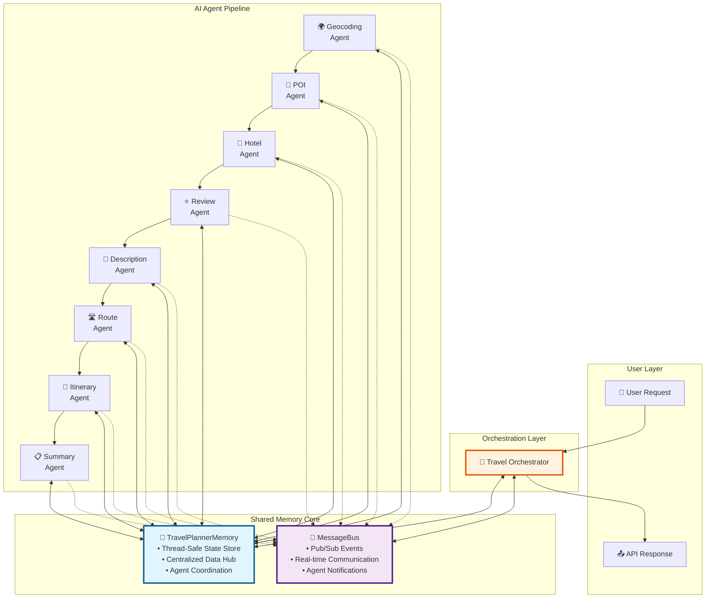
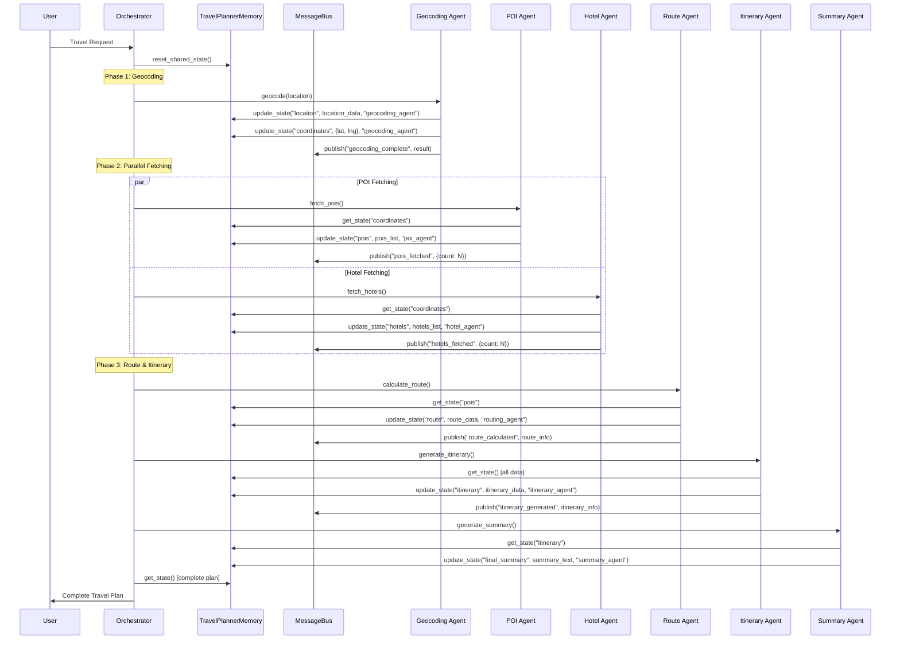

# WanderWise: AI Travel Planner

## Overview

WanderWise is a full-stack AI travel planner that generates personalized multi-day itineraries using a coordinated set of specialized agents. It combines a FastAPI backend, Next.js frontend, and a shared-memory LangChain orchestration layer.

### Core Features

| Capability | Description |
|------------|-------------|
| Multi-Agent Pipeline | Geocoding, POIs, hotels, enrichment, routing, itinerary, summary |
| Shared Memory + Bus | Thread-safe state + pub/sub event coordination |
| Smart Itinerary | LLM-enhanced day-by-day plans with final summary |
| Frontend UI | Modern Next.js interface with progress + results tabs |
| Hotels & POIs | Ranked POIs and hotels (with website links) |
| Route Planning | Segment-based route with distance & time |
| Auth & Rate Limit | Simple API key protection (dev key included) |
| Docker Ready | Compose setup for deployment |

## Architecture (High-Level)

Shared memory drives agent collaboration; the orchestrator coordinates flow and events.



## Data Flow (Execution Phases)

Request → Geocode → Parallel (POIs + Hotels) → Enrichment → Route → Itinerary → Summary → Response.



## Quick Start

Backend:
```bash
python -m venv env
source env/bin/activate
pip install -r requirements_fastapi.txt
uvicorn api.main:app --reload --port 8000
```

Frontend:
```bash
cd frontend
npm install
npm run dev
```

Open UI: http://localhost:3000

API Docs: http://localhost:8000/docs

Dev API Key: `wanderwise-dev-key-2024`

## Minimal API Surface

| Method | Endpoint | Purpose |
|--------|----------|---------|
| POST | /generate-travel-plan | Generate full plan |
| GET | /health | Health check |
| GET | /docs | Swagger UI |

Request body fields (core): destination, start_date, end_date, preferences (budget, travel_style, group_size, interests[]).

## Output Structure

Response includes:
* executive_summary (now final summary)
* points_of_interest (name, rating, description, coordinates)
* hotels (name, rating, website)
* itinerary (days → activities with times)
* routes (segments, distance, duration)
* file_paths (saved artifacts)

## CLI (Optional)
```bash
pip install -r requirements_langchain.txt
python main_langchain.py --location "Rome, Italy" --duration 3
```

## Project Status

- Core pipeline stable (POIs, hotels, route, itinerary, summary)
- Hotels now surface website links (price/description removed)
- Frontend aligned with simplified hotel model
- Final summary replaces generic executive summary
- Ready for deployment link insertion later

## Next Steps (Planned)

- Deployment URL & badge
- User auth & persistence backend
- Caching & retry policies
- Export (PDF / share link)

## Additional Docs

See: `README_FASTAPI.md`, `README_LANGCHAIN.md`, `README_AUTHENTICATION.md` for deeper details.

## Installation

1. Install LangChain dependencies:
```bash
pip install -r requirements_langchain.txt
```

2. Set your Gemini API key (recommended):
```bash
export GEMINI_API_KEY="your-api-key-here"
```

Get your free API key from: https://makersuite.google.com/app/apikey


## Interfaces

### 1. FastAPI Web Application

The most user-friendly way to use WanderWise:

```bash
# Start the web server
python start_api.py

# Or using uvicorn directly
uvicorn api.main:app --host 0.0.0.0 --port 8000
```

**Available Endpoints:**
- `POST /generate-travel-plan` - Generate complete travel plans
- `GET /destinations` - List processed destinations
- `GET /download/{file_type}` - Download generated files
- `GET /web` - Interactive web interface
- `GET /docs` - API documentation (Swagger UI)
- `GET /health` - Health check

### 2. Command Line Interface

For developers and automation:

```bash
# Interactive mode (recommended)
python main_langchain.py --interactive

# Direct command mode
python main_langchain.py "Tokyo, Japan" "2024-06-01" "2024-06-03"
```

### 3. Python API Client

For programmatic integration:

```python
from api.client_example import TravelPlannerClient

client = TravelPlannerClient()
result = client.generate_travel_plan(
    destination="Rome, Italy",
    start_date="2024-06-01",
    end_date="2024-06-03",
    use_llm=True
)
```

### Environment Variables

- `GEMINI_API_KEY` - Google Gemini API key (optional, uses fallback if not set)
- `GOOGLE_MAPS_API_KEY` - Google Maps API key (optional)

## Features

### Parallel Execution
- POI fetching and hotel search run simultaneously
- LLM-based POI recommendations run in parallel with API-based fetching
- Significant performance improvements over sequential execution

### Agent Communication
- **Shared Memory**: Thread-safe state management across all agents
- **Message Bus**: Pub/sub system for real-time coordination
- **State Tracking**: Complete audit trail of agent interactions

### Performance Monitoring
- Execution timing for each agent
- Tool usage statistics
- Error tracking and reporting
- Memory usage and state size monitoring

### Error Handling
- Graceful failure recovery
- Detailed error reporting with agent context
- Partial results when some agents fail
- Retry mechanisms for transient failures

